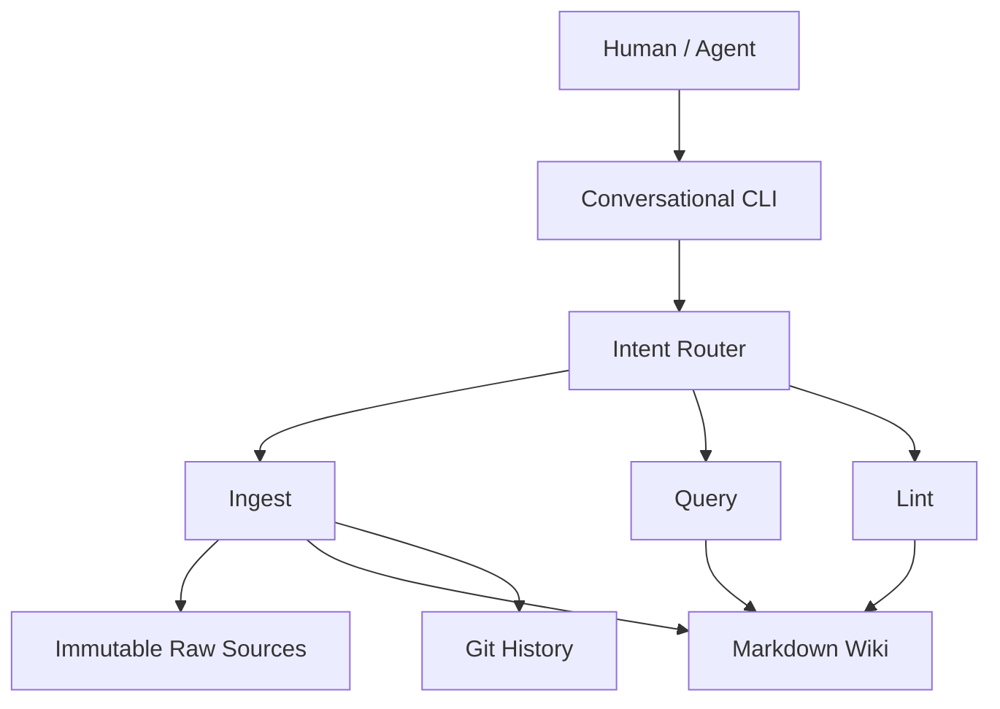

# Architecture

## Purpose and scope

GoFlight Team Memory compiles shared operator, aircraft, and customer knowledge
into an inspectable Markdown wiki. The required layers are immutable attributed
raw sources, a compiled wiki, and the maintenance rules in `schema.md`. Git provides
real development and memory change history.

Milestone 2 added attributed ingest, structured extraction, deterministic wiki
reconciliation, repository locking, and runtime Git commits. Milestone 3 adds
bounded wiki querying with grounded synthesis and citations. Lint and human
conflict resolution remain **not implemented**.

## Intended flow

The diagram shows the target flow; only lint remains a future operation.

All components run in one local Python application against one shared Git
checkout. `agent/` owns conversation, `core/` owns validated records, `wiki/` is
responsible for deterministic compilation and Markdown parsing, `llm/` owns the OpenAI adapter, and
`infra/` owns paths and configuration. No orchestration framework is needed.

## Trust boundary and invariants

| LLM responsibilities | Deterministic Python responsibilities |
| --- | --- |
| Semantic interpretation | Source identity and unchanged source persistence |
| Fact extraction | Filesystem operations and path validation |
| Relevant page selection | Provenance validation and conflict persistence |
| Grounded answer synthesis | Locking, Git operations, Markdown links, future lint checks |

Raw sources are the evidence of record. Wiki claims are derived from that evidence
and must retain source and contributor attribution. The LLM proposes content;
Python validates it before writing. Source metadata requires a timezone and disallows
assignment. UTF-8 raw source files have JSON-quoted YAML scalar metadata and an
unchanged note body. Sequential source IDs are allocated and exclusively created under lock.

Extracted facts represent one textual value and one source/contributor pair.
Wiki fact rows aggregate matching evidence. Values compare with Unicode NFKC,
case folding, and collapsed whitespace. Different values for one entity/field create
an unresolved conflict with a stable hash ID and all evidence. There is no semantic
conflict resolution; multi-valued fields can conservatively produce false positives.

Markdown tables are the authoritative wiki representation; no JSON sidecar or hidden
database exists. Python escapes textual data, parses the known table format, and
re-renders deterministically. Unsupported manual page/index edits block ingestion
instead of being lost. Entity filenames use ASCII slugs; ambiguous slug collisions
are rejected. Aircraft `operator` facts generate reciprocal links with evidence.

## Operations and failure handling

- **Ingest:** acquire repository write lock → read latest state → preserve source →
  extract/compare facts → validate and persist evidence/conflicts → update wiki,
  index, and changelog → Git commit → release lock. Every writer must cooperate.
  This protects only a single shared filesystem environment, not distributed writers.
  The POSIX `flock` lock file is retained and ignored by Git. Compile every page in
  memory before writing; replace each changed file with a same-directory temporary
  file. Snapshot originals and restore only transaction-owned files/staging on caught
  failures. Preserve a fully written raw note as pending for an exact-text/same-user
  retry. Pending raw notes block other input; committed exact retries return the
  existing commit. This is intentional deduplication, not semantic similarity search.
  SIGKILL/power loss can leave dirty state requiring manual review; no crash journal
  is implemented. If HEAD advances ambiguously, do not roll back potentially committed
  files. Git commits require configured identity, stage explicit memory files, and
  exclude unrelated work. Existing staged changes or dirty memory block ingest.
- **Query:** question → index/page catalog → exact entity-name matching or one LLM
  selection call → bounded relevant link traversal → grounded LLM synthesis → answer
  plus validated page citations. **Raw historical sources are not used as the query
  retrieval corpus**, including for page validation. Query uses a dedicated read
  path, not ingest's source-validating `load_pages`. There is no vector/embedding
  retrieval. Inline Markdown links are the knowledge graph.
  Up to five entity pages and two link hops are read in breadth-first order with
  deduplication; link relevance uses named targets and a small relationship-type
  vocabulary. Only catalogued entities can become context. Relative links resolve
  inside the wiki; external/raw links and symlinks are excluded. Per-page and index
  byte limits prevent unbounded context, without silently truncating evidence.
  The existing write-lock file is opened read-only with a shared lock during context
  collection, then released before synthesis. If absent, no file is created; a writer
  creating it during reads triggers a retry error. This protects cooperating ingests,
  not arbitrary manual edits. Queries neither call Git nor modify memory.
  Pydantic validates selection and synthesis. Python validates citations against
  actual context, converts unsupported answers to an explicit unknown response, and
  appends deterministic conflict notices with all values. It rejects a response
  mentioning only one literal side of a conflict; this is not a full semantic
  grounding verifier. A bounded selection can miss other relevant pages, and
  conservative notices can mention unrelated conflicts on consulted pages.
- **Lint (planned):** diagnose unresolved conflicts, orphan pages, broken links, and missing
  evidence references through deterministic checks; do not silently repair them.

## Configuration and delivery

The supported install is editable from a source checkout with Python 3.12+.
Paths default to that checkout, independent of the launch directory. An exported
`GOFLIGHT_ROOT` selects another checkout before its `.env` is read. Shell environment
values take precedence over `.env`; `--user` takes precedence over `GOFLIGHT_USER`.
Contributor identity is a user-supplied label, with authentication out of scope.
`OPENAI_API_KEY` and optional `OPENAI_MODEL` configure the sole OpenAI adapter.
The default is `gpt-4.1-mini`; structured Responses output is validated by Pydantic
and again against Python-owned source/contributor identity. Canonical field names
are constrained by the schema and Python. Requests have a 45-second timeout, no SDK
retries, no tools, and response storage disabled. Natural language is classified
before mutation; `/add` bypasses routing. Obvious questions/greetings need no API
call. Query invokes the read-only query API; lint retains its milestone notice.

Validation covers domain invariants, path resolution, configuration, provider calls
with mocks, real temporary Git commits, provenance merging, contradictions, retries,
write/commit failures, process locking, concurrent ingests, query traversal bounds,
path/citation safety, unknown/conflict propagation, and unchanged files/Git history
after queries. The README supplies opt-in real-API ingest and query demos. Later
milestones add deterministic lint (4) and broader demo/concurrency hardening (5).
