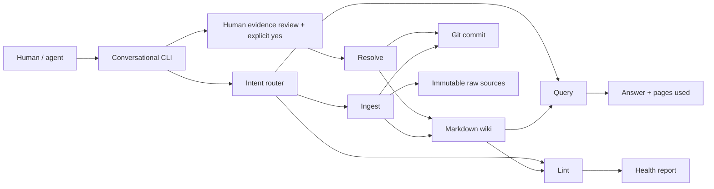

# Architecture

One local Python application compiles attributed team notes into an inspectable
Markdown wiki. Git holds real development and ingest history; no vector database,
chunk-based RAG, SQL, or agent orchestration framework is used.

## Storage and trust boundary

`memory/raw/source-NNN.md` stores exact note text with contributor, type, ID, and UTC
timestamp. `memory/wiki/{operators,aircraft,customers}/` stores fact/evidence tables,
related links, conflicts, and sources; `index.md` and `CHANGELOG.md` provide navigation
and attributed summaries. `schema.md` defines supported fields. No hidden state store.

The LLM handles ambiguous routing, structured extraction, optional page selection,
and grounded synthesis. Python validates schema/provenance, owns IDs and safe paths,
reconciles facts, preserves conflicts, writes files, locks, commits, and lints.
Provider responses are proposals, not trusted instructions. Structured output does
not guarantee semantic correctness. Only `llm/client.py` imports the provider SDK.

## Operations

- **Ingest:** exclusive lock → preserve raw text → LLM extraction with schema → validate
  attribution → reconcile facts → render wiki/index/changelog → scoped Git commit.
  Explicit supported entity assertions use a small deterministic extraction grammar
  after raw storage and can create source-backed pages without invented facts.
  Matching normalized values merge evidence; differing values retain both sides and
  produce stable unresolved records. Aircraft/operator facts create reciprocal links.
  Exact same-user/text retries return the original commit. Caught failures restore
  wiki/staging and keep a saved source pending for retry. Dirty memory and unrelated
  staged work block ingestion. No manual edits are silently discarded.
- **Query:** index catalog → exact name match or structured page selection → relevant
  breadth-first traversal → LLM answer → validated citations and conflict notices.
  Only catalogued wiki pages become context; raw notes never do. Limits: 5 pages,
  2 hops, 32 KiB/page, 64 KiB/index. Unsupported answers become unknown; literal
  relevant one-sided conflict answers trigger one evidence-guided retry, then a
  deterministic fallback on failure. Unrelated conflicts do not block an answer.
  Resolved fields supply their current human value, not historical alternatives.
  Query never calls Git or writes memory.
- **Lint:** Markdown scanner → recorded-conflict parser → dictionary/set link graph →
  source-reference validation → report. No LLM or writes. Unresolved records and zero
  incoming-link entities are warnings; broken references and malformed state are errors.
  Index/changelog links count; raw/self-links do not. Infrastructure cannot be orphaned.
  Per-page errors preserve the remaining scan; root/lock failures are explicit.
- **Resolve:** human review/yes → exclusive lock → validate ID and evidence revision →
  append human value/reviewer/reason/time → preserve original facts → page/changelog
  only → scoped Git commit. Failure rolls back owned edits/staging; ambiguous HEAD
  changes require inspection. No LLM chooses or submits decisions. Short-lived list
  numbers map to existing stable conflict IDs, not new persistent identities.

`WikiPage`/`Conflict`/`Resolution` and the shared Markdown parser own conflict state for
all four operations. An unresolved field becomes resolved only via a recorded human
decision. New distinct evidence reopens the same ID without deleting decision history;
additional evidence for already-reviewed values keeps the decision active.

## Concurrency, delivery, and limits

`fcntl.flock` serializes cooperating ingests and resolutions sharing one repository/filesystem,
including provider calls and Git. Query/lint/status share read locks without creating
lock files; query releases its lock before synthesis. Independent distributed nodes
and manual edits are not protected. Power loss/SIGKILL may need manual recovery;
atomic per-file replacement is not a crash-safe multi-file transaction.

`agent/` owns UX, `core/` operations/models, `wiki/` compilation/parsing, `infra/`
paths/configuration/locking/Git. `demo.py` initializes only a new isolated directory
and feeds fictional notes through production ingest; it never resets existing data.

Limits: whole-wiki reconciliation, bounded query, generated Markdown dialect, no
semantic/temporal resolution, full graph reachability, or grounding proof. Contributor
labels are unauthenticated. Query relevance/safety and explicit-command recognition
are bounded heuristics. No UI, MCP, deployment, or automatic truth resolution.
See [M5.1 validation](docs/VALIDATION_5_1.md) and [decisions](DECISIONS.md).
