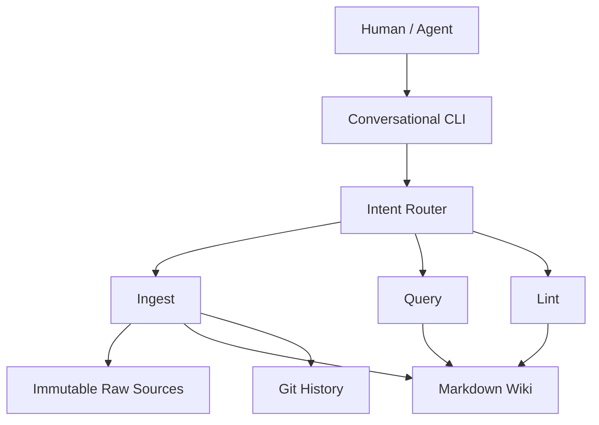

# Architecture

## Purpose and scope

GoFlight Team Memory compiles shared operator, aircraft, and customer knowledge
into an inspectable Markdown wiki. The required layers are immutable attributed
raw sources, a compiled wiki, and the maintenance rules in `schema.md`. Git provides
real development history and, in a later milestone, memory change history.

Milestone 1 implements domain records, centralized paths and environment loading,
an empty wiki, and a read-only conversational CLI. The router and LLM client are
explicit stubs. Ingest, query, lint, automatic Git operations, and locking are
planned and **not implemented**.

## Intended flow

The diagram shows the target flow; only the CLI shell exists today.

All components will run in one local Python application against one shared Git
checkout. `agent/` owns conversation, `core/` owns validated records, `wiki/` is
reserved for compilation and reading, `llm/` owns the future provider adapter, and
`infra/` owns paths and configuration. No orchestration framework is needed.

## Trust boundary and invariants

| LLM responsibilities (planned) | Deterministic Python responsibilities |
| --- | --- |
| Semantic interpretation | Source identity and unchanged source persistence |
| Fact extraction | Filesystem operations and path validation |
| Relevant page selection | Provenance validation and conflict persistence |
| Grounded answer synthesis | Locking, Git operations, Markdown links, lint checks |

Raw sources are the evidence of record. Wiki claims are derived from that evidence
and must retain source and contributor attribution. The LLM will propose content;
Python will validate it before writing. The source metadata model requires a timezone
and disallows assignment, but filesystem immutability is future ingest work.

Facts currently represent one textual value and one source/contributor pair.
Conflict records retain full facts, require distinct values for the same entity and
field, and default to unresolved. These are structural checks, not semantic conflict
detection. Matching evidence aggregation and on-disk formats remain Milestone 2 work.

## Planned operations and failure handling

- **Ingest:** acquire repository write lock → read latest state → preserve source →
  extract/compare facts → validate and persist evidence/conflicts → update wiki,
  index, and changelog → Git commit → release lock. Every writer must cooperate.
  This protects only a single shared filesystem environment, not distributed writers.
  Milestone 2 must define failure recovery for partial writes and commit failures;
  a lock alone does not provide rollback or make multiple file writes atomic.
- **Query:** inspect the index, select pages, follow bounded Markdown links, then
  synthesize strictly from those wiki pages and return their paths. Unknown facts
  stay unknown; unresolved conflicts must be exposed. Do not search raw note history.
- **Lint:** diagnose unresolved conflicts, orphan pages, broken links, and missing
  evidence references through deterministic checks; do not silently repair them.

## Configuration and delivery

The supported install is editable from a source checkout with Python 3.12+.
Paths default to that checkout, independent of the launch directory. An exported
`GOFLIGHT_ROOT` selects another checkout before its `.env` is read. Shell environment
values take precedence over `.env`; `--user` takes precedence over `GOFLIGHT_USER`.
Contributor identity is a user-supplied label, with authentication out of scope.
No provider or API key is needed in Milestone 1.

Foundation validation covers domain invariants, path resolution, configuration
precedence, installation, and shell behavior. Later milestones add ingest (2),
grounded query (3), deterministic lint (4), and demo/concurrency hardening (5).
